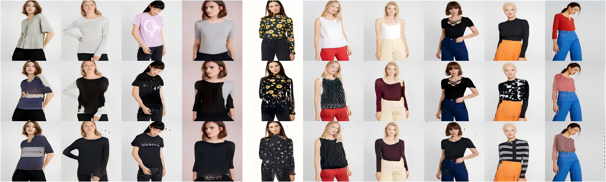

## Overall Architecture


## Dependencies
python 3.6.13
Install dependencies using pip.
```shell
pip install -r requirements.txt
pip install git+https://github.com/keras-team/keras-contrib.git
```
## Data
Dataset we used:
-[zalando-hd-resized](https://www.dropbox.com/scl/fi/xu08cx3fxmiwpg32yotd7/zalando-hd-resized.zip?rlkey=ks83mdv2pvmrdl2oo2bmmn69w&e=2&dl=0)

## Step1: CAGAN 


### code and data ###
* Training:  `CAGAN.py`
```
python CAGAN.py
```
* Testing: `Testing_with_fixed_data.py`
```
python Testing_with_fixed_data.py
```

## Step2: Segmentation ##


### code ###
* Training: `train_pgn.py`
```
python train_pgn.py
```

* Modify mask: `modify_mask.m`

* Save the masks file to png file: `show.m`

* Combine all the masks: `combine_with_CAGANmask.m`

### checkpoint ###
Checkpoint we used:
-[LIP_PGN](https://drive.google.com/drive/folders/1w_KrEBt4FKS-AjgvZGAIXUaiZnq9oRMa?usp=drive_link)

## Step3: Transform ##
### checkpoint ###
Checkpoint we used:
-[step3](https://drive.google.com/file/d/1MhUoFfIoPUJFycfMeZzSa8mAXeZtWBF1/view?usp=drive_link)


### code and data ###

* Training: `unet.py` `data.py`
```
python unet.py
```

* Testing: `Testing_unet.py`
```
python Testing_unet.py
```


### parameters in code ###
#### Training: unet.py

>336: model_dir = "save model path"
>
>337: result_dir = "save results path"
>
>223: set "loss type"

#### data.py

>15: set "data path"


#### Testing: Testing_unet.py

>16: test_data_path = "data path"
>
>17: test_img_folder = "target clothes image folder name"
>
>18: test_mask_folder = "mask folder name"
>
>19: model_name = "model name"
>
>20: result_dir = "save results path"


## Step4: Combination ##


### code ###
`Combine_image.m`

## Results

